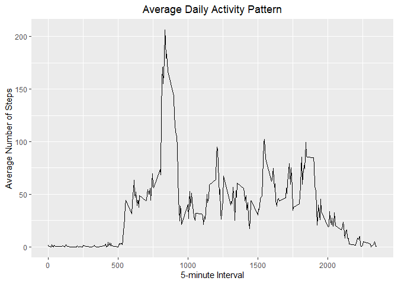

Reproducible Research Project 1
================
Jolin
12/21/2020

## Loading and preprocessing the data

### Load the data

``` r
activity <- read.csv(file="activity.csv", header=TRUE)
head (activity)
```

    ##   steps       date interval
    ## 1    NA 2012-10-01        0
    ## 2    NA 2012-10-01        5
    ## 3    NA 2012-10-01       10
    ## 4    NA 2012-10-01       15
    ## 5    NA 2012-10-01       20
    ## 6    NA 2012-10-01       25

### Process/transform the data (if necessary) into a format suitable for your analysis

``` r
activity$date <- as.Date(activity$date)
```

## What is mean total number of steps taken per day?

### Calculate the total number of steps taken per day

``` r
totalsteps <- aggregate(steps ~ date, activity, FUN=sum)
head(totalsteps)
```

    ##         date steps
    ## 1 2012-10-02   126
    ## 2 2012-10-03 11352
    ## 3 2012-10-04 12116
    ## 4 2012-10-05 13294
    ## 5 2012-10-06 15420
    ## 6 2012-10-07 11015

### Make a histogram of the total number of steps taken per day

``` r
hist(totalsteps$steps,
     main = "Total Steps per Day",
     xlab = "Number of Steps")
```

<!-- -->

### Calculate and report the mean and median of the total number of steps taken per day

``` r
meansteps <- mean(totalsteps$steps)
medsteps <- median(totalsteps$steps)
```

Mean number of steps per day = 1.076618910^{4} Median number of steps
per day = 10765

## What is the average daily activity pattern?

### Make a time series plot (i.e. type = “l”) of the 5-minute interval (x-axis) and the average number of steps taken, averaged across all days (y-axis)

``` r
library(ggplot2)
meanstepsint <- aggregate(steps ~ interval, activity, mean)
ggplot(data = meanstepsint, aes(x = interval, y = steps)) +
  geom_line() +
  ggtitle("Average Daily Activity Pattern") +
  xlab("5-minute Interval") +
  ylab("Average Number of Steps") +
  theme(plot.title = element_text(hjust = 0.5))
```

<!-- -->

### Which 5-minute interval, on average across all the days in the dataset, contains the maximum number of steps?

``` r
maxint <- meanstepsint[which.max(meanstepsint$steps),]
maxint
```

    ##     interval    steps
    ## 104      835 206.1698

## Inputing missing values

### Calculate and report the total number of missing values in the dataset (i.e. the total number of rows with NAs)

``` r
missing <- sum(is.na(activity$steps))
missing
```

    ## [1] 2304

The total number of missing values is 2304.

### Devise a strategy for filling in all of the missing values in the dataset.

Replace the NA values with the average of the interval

### Create a new dataset that is equal to the original dataset but with the missing data filled in.

``` r
activity2 <- activity 
for (i in meanstepsint$interval) {
    activity2[activity2$interval == i & is.na(activity2$steps), ]$steps <- 
        meanstepsint$steps[meanstepsint$interval == i]
}
newmissing <- sum(is.na(activity2))
```

A new dataset has been created with 0 NA values.

### Make a histogram of the total number of steps taken each day

``` r
totalsteps2 <- aggregate(steps ~ date, activity2, FUN=sum)
hist(totalsteps2$steps,
     main = "Total Number of Steps Per Day (after input)",
     xlab = "Number of Steps")
```

<!-- -->

### Calculate and report the mean and median total number of steps taken per day.

``` r
meansteps2 <- mean(totalsteps2$steps)
medsteps2 <- median(totalsteps2$steps)
```

Mean total number of steps per day = 1.076618910^{4} Median total number
of steps per day = 1.076618910^{4}

### Do these values differ from the estimates from the first part of the assignment? What is the impact of imputing missing data on the estimates of the total daily number of steps?

``` r
diffmean = meansteps2 - meansteps
diffmed = medsteps2 - medsteps
```

The difference in mean values is 0. The difference in median values is
1.1886792.

## Are there differences in activity patterns between weekdays and weekends?

### Create a new factor variable in the dataset with two levels – “weekday” and “weekend” indicating whether a given date is a weekday or weekend day.

``` r
daytype <- function(date) {
  day <- weekdays(date)
  if (day %in% c('Monday', 'Tuesday', 'Wednesday', 'Thursday', 'Friday'))
      return ("weekday")
  else if (day %in% c('Saturday', 'Sunday'))
      return ("weekend")
  else
      stop ("Invalid Date")
}
activity2$day <- sapply(activity2$date, FUN = daytype)

head (activity2)
```

    ##       steps       date interval     day
    ## 1 1.7169811 2012-10-01        0 weekday
    ## 2 0.3396226 2012-10-01        5 weekday
    ## 3 0.1320755 2012-10-01       10 weekday
    ## 4 0.1509434 2012-10-01       15 weekday
    ## 5 0.0754717 2012-10-01       20 weekday
    ## 6 2.0943396 2012-10-01       25 weekday

### Make a panel plot containing a time series plot (i.e. type = “l”) of the 5-minute interval (x-axis) and the average number of steps taken, averaged across all weekday days or weekend days (y-axis).

``` r
meanstepsdaytype <- aggregate(steps ~ interval + day, activity2, mean)
ggplot(data = meanstepsdaytype, aes(x = interval, y = steps)) + 
  geom_line() +
  facet_grid(day ~ .) +
  ggtitle("Average Daily Activity Pattern") +
  xlab("5-minute Interval") +
  ylab("Average Number of Steps") +
  theme(plot.title = element_text(hjust = 0.5))
```

<!-- -->
